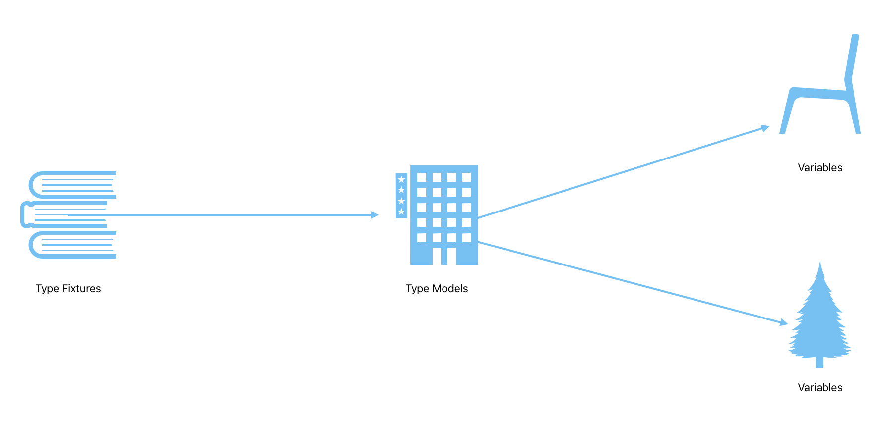

# typescript-type-boilerplate
This repository demonstrates how a team can scale their type collections according to fixtures to clearly understand all variables, objects, and properties faster, making the development cleaner and reducing confusion.

### 🧱 System Architecture

Fixtures are nothing but the technical documentation or sample variables that inform models about the types that need to have. With this approach, developers will not only see the type of a variable, but they will also understand its deeper purpose by reviewing the fixture related to the variable they are dealing with.